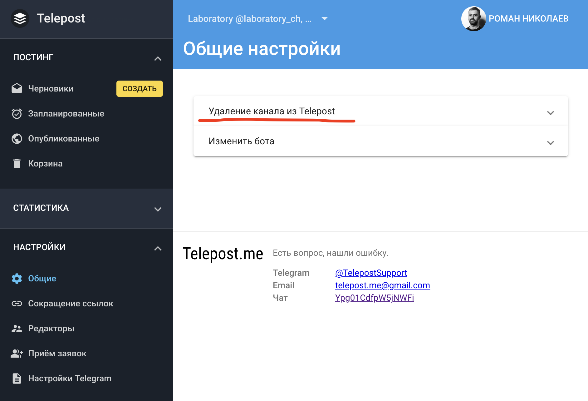

# Удаление канала из Телепост

Для того, чтобы удалить добавленный ранее канал из Телепоста:

1. откройте в веб-версию: [{{ telepost.webApp.name }}]({{ telepost.webApp.url }}) и перейдите в раздел "Настройки" → "Общие":

   

1. Раскройте пункт "Удаление канала из Telepost":

   

1. Там будет предупреждение:

   

   Введите указанный код и нажмите <kbd>УДАЛИТЬ</kbd>.
