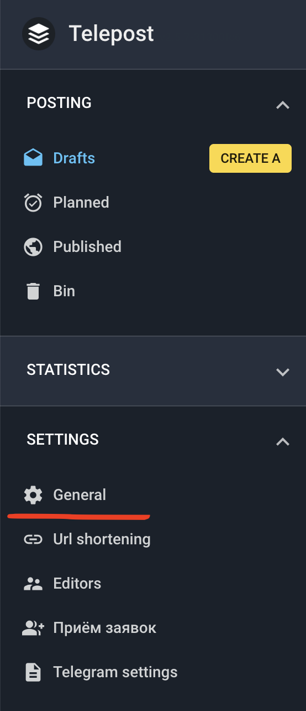
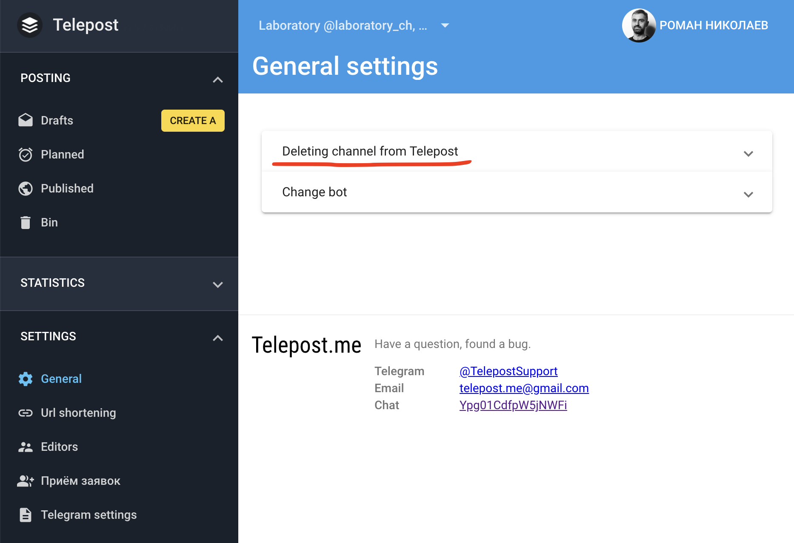
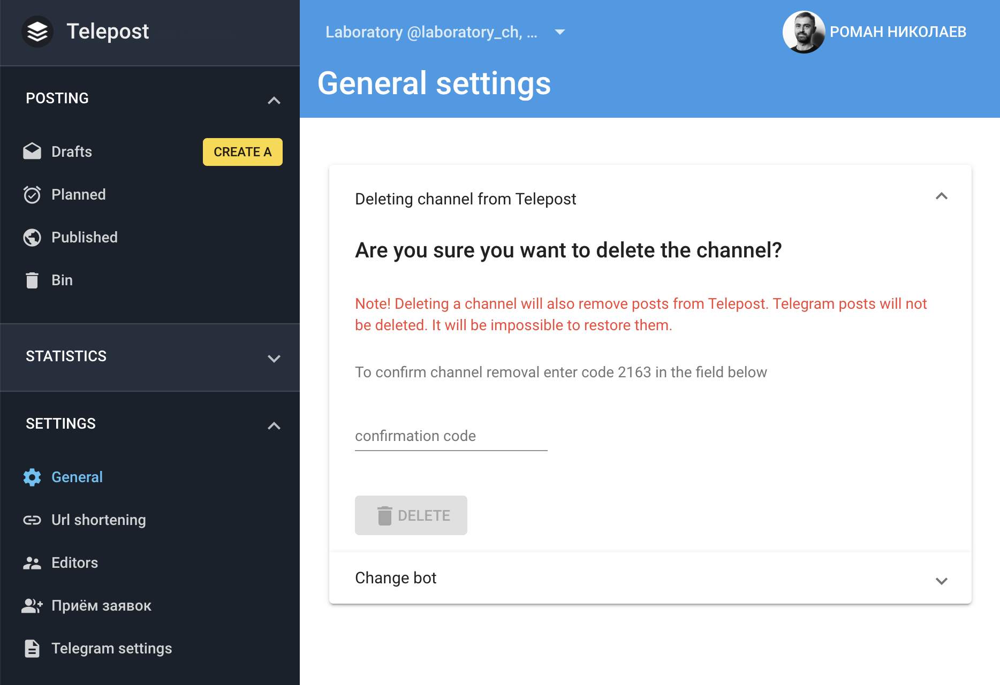

# Delete channel from Telepost

To delete a previously added channel from Telepost:

1. Open the web version: [{{ telepost.webApp.name }}]({{ telepost.webApp.url }}) and go to "Settings" → "General":

   

1. Expand the "Deleting channel from Telepost" item:

   

1. There will be a warning:

   

   Enter the code and click <kbd>DELETE</kbd>.
